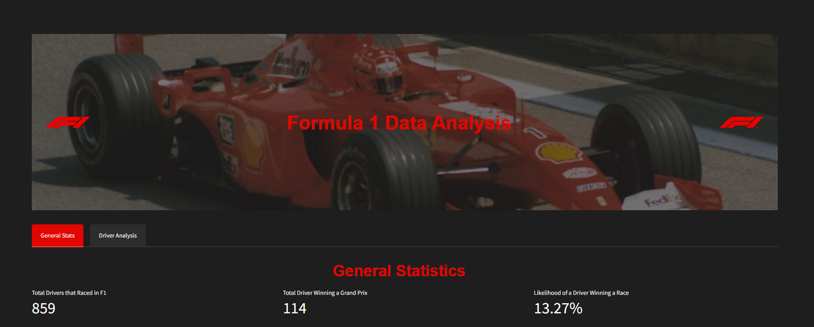

# F1 Data Analysis



An interactive Streamlit app for exploring Formula 1 statistics, driver performances, and constructor impacts across seasons.

[](https://f1-data-analysis.streamlit.app/)


## Features

- General statistics overview of F1 history
- World Champions visualization
- Top drivers and constructors analysis
- Interactive driver comparison tool
- Race-by-race result exploration


## Installation for local usage

1. Clone this repository:
   ```
   git clone https://github.com/yourusername/f1-data-analysis.git
   cd f1-data-analysis
   ```

2. Install the required packages:
   ```
   pip install -r requirements.txt
   ```

3. Run the Streamlit app:
   ```
   streamlit run f1-streamlit-app_v4.py
   ```

## Data Sources

This project uses Formula 1 data from [Kaggle](https://www.kaggle.com/datasets/rohanrao/formula-1-world-championship-1950-2020) The data is preprocessed and stored in CSV files within the `data/` directory.

## How to Use

**Disclaimer**: The app is optimized for dark mode. If your browser is set to light mode, some elements may not display correctly. We recommend switching to dark mode for the best experience.
After launching the app, you'll see two main tabs: "General Stats" and "Driver Analysis".

### General Stats Tab

1. **Overall Statistics**: At the top, you'll see key figures about F1 history, including total drivers, race winners, and winning likelihood.

2. **World Champions**: A bar chart showing the number of titles won by each World Champion.

3. **Top Drivers**: View the top 10 drivers adjusted by total races participated. This helps compare drivers across different eras.

4. **Top Constructors**: Similar to top drivers, but for constructor teams.

5. **Detailed Tables**: Scroll down to see more comprehensive tables for drivers and constructors.

### Driver Analysis Tab

1. **Driver Selection**: Use the multi-select dropdown to choose up to 5 drivers for comparison.

2. **Year Range**: Adjust the slider to focus on specific years or a driver's career span.

3. **Circuit Selection**: Choose a specific circuit or keep "All" for overall comparison.

4. **Performance Charts**:
   - Average Points per Race: Shows how drivers' point-scoring has changed over time.
   - Cumulative Wins: Visualizes the pace at which drivers accumulate wins.
   - Average Finishing Position: Lower is better; shows consistency in race finishes.

5. **Race Results**: A detailed table of individual race results for the selected drivers.

### Tips for Using the App

- Hover over data points in charts for more detailed information.
- The app is responsive to screen size and supports dark mode for comfortable viewing.
- Use the "General Stats" tab for an overview and historical context, and the "Driver Analysis" tab for detailed comparisons.
- Experiment with different driver combinations and year ranges to uncover interesting trends and rivalries.

## Contributing

Contributions to improve the app or extend its functionality are welcome. Please feel free to submit pull requests or open issues for bugs and feature requests.

## License

This project is open source and available under the [MIT License](LICENSE).

## Acknowledgments

- Formula 1 for the exciting sport that inspired this project
- Streamlit for making it easy to create data apps
- The open-source community for the various libraries used in this project
